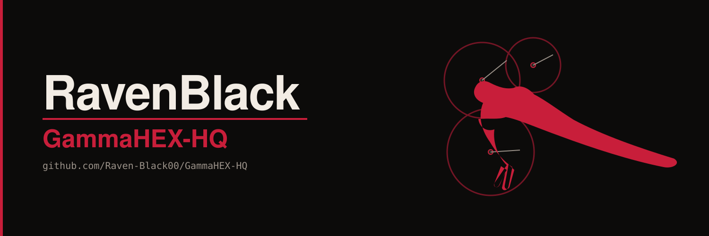

<p align="center">
  
</p>

# GammaHEX-HQ

**v1.0.0** · **RavenBlack** · Python 3.9+ · Windows (core dashboard is cross-platform) · MIT

GUI and firmware for the Bitaxe Hex (6 ASIC) miner — a live telemetry command center for the Bitaxe / NerdQAxe family. Animated gauges, thermal watch, ntfy.sh alerts, system-tray integration.

The working title **RavenMiner HQ is retired.** This repo and product are **GammaHEX-HQ**, under the **RavenBlack** mark.

Source of truth on GitHub: **[Raven-Black00/GammaHEX-HQ](https://github.com/Raven-Black00/GammaHEX-HQ)**.

It speaks the AxeOS local API (`/api/system/info`) that every board in this lineage still exposes: NerdQAxe, NerdQAxe+ / ++, NerdOCTAXE, Bitaxe Gamma, Bitaxe Hex, and Satoshi-branded cousins.

`GammaHEX_HQ.py` — starting version **1.0.0**.

The previous working filename (`GammaHex1300_5.9.3.11.py` / RavenMiner HQ 5.9.3.11) is retired with the RavenMiner HQ title. Lineage still in the script header:

- **BitaxeGammaHex** — first-class Gamma and Hex telemetry
- **Satoshi** — Solo Satoshi / Satoshi-branded hardware in the same API family
- **CurrGauge100A** — 100-amp current needle for high-draw Hex-class rails

---

## Quick start

**Needs.** Python 3.9+. A Bitaxe Gamma / Hex / Supra, or a NerdQAxe / + / ++ / OCTAXE, running AxeOS or ESP-Miner-NerdQAxePlus. Windows recommended for tray, startup registry, and `winsound`; the core dashboard runs cross-platform.

```bash
git clone https://github.com/Raven-Black00/GammaHEX-HQ.git
cd GammaHEX-HQ
pip install -r requirements.txt
python GammaHEX_HQ.py
```

Launch minimized to tray:

```bash
python GammaHEX_HQ.py --minimized
```

**First launch.** HQ writes `ravenminer_config.json` next to the script. Set the miner's LAN IP (placeholder `192.168.68.100`) in Settings. Optionally paste an ntfy.sh topic URL for phone push.

Keep the `assets/` folder next to `GammaHEX_HQ.py` — horn, mark, and lightning frames load from there.

---

## Layout

```
GammaHEX-HQ/
├── GammaHEX_HQ.py
├── VERSION
├── requirements.txt
├── README.md
├── CHANGELOG.md
├── LICENSE
├── .gitignore
├── assets/          # horn, mark, lightning frames (base64)
└── docs/
```

Do not commit the three runtime JSON files. They are gitignored on purpose.

---

## Standalone .exe

```powershell
pyinstaller --onefile --windowed --name GammaHEX-HQ `
  --add-data "assets;assets" `
  --hidden-import=PIL._tkinter_finder --hidden-import=pystray --hidden-import=pystray._win32 `
  --collect-all=PIL GammaHEX_HQ.py
```

---

## License

MIT. Hardware and firmware this app talks to are separately licensed (CERN-OHL-S hardware, GPL-3.0 ESP-Miner / NerdQAxePlus). HQ is a client, not a firmware fork.
